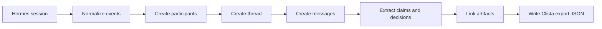

# Hermes Thread Emission Sketch

This sketch assumes Hermes can expose a session transcript as ordered events. If Hermes has a different shape, keep the Clista objects stable and only replace the adapter.

## Goal

Turn one Hermes session into a Clista export containing:

- Participants
- A thread
- Messages
- Claims
- Decisions
- Artifacts

The adapter should be boring and deterministic. It should not decide what is true; it should preserve what happened, extract candidate structure, and mark uncertain extraction as draft.

## Minimal Flow



## Event Mapping

| Hermes input | Clista output |
| --- | --- |
| Session metadata | `thread` |
| User or assistant turn | `message` |
| Named agent/tool identity | `participant` |
| File, URL, generated output | `artifact` |
| Explicit assertion, objection, recommendation | `claim` |
| Choice, commitment, approval, rejection | `decision` |

## Pseudocode

```ts
type HermesEvent = {
  id: string;
  type: "message" | "tool_call" | "tool_result" | "file" | "decision_hint";
  actor: string;
  createdAt: string;
  text?: string;
  payload?: unknown;
};

export function emitClistaThread(session: {
  id: string;
  title?: string;
  events: HermesEvent[];
}) {
  const participants = collectParticipants(session.events);
  const thread = {
    id: `thd_${session.id}`,
    object: "thread",
    title: session.title ?? "Untitled Hermes session",
    status: "active",
    participantIds: participants.map((p) => p.id),
    createdAt: firstTimestamp(session.events),
    updatedAt: lastTimestamp(session.events),
    metadata: {
      source: "hermes",
      sourceSessionId: session.id
    }
  };

  const messages = session.events
    .filter((event) => event.type === "message")
    .map((event, index) => ({
      id: `msg_${event.id}`,
      object: "message",
      threadId: thread.id,
      participantId: participantIdFor(event.actor),
      index,
      createdAt: event.createdAt,
      content: event.text ?? "",
      claimIds: [],
      artifactIds: []
    }));

  const artifacts = extractArtifacts(session.events, thread.id);
  const claims = extractClaims(messages);
  const decisions = extractDecisions(messages, claims, artifacts);

  return {
    schema: "clista.mvp.v0",
    exportedAt: new Date().toISOString(),
    participants,
    threads: [thread],
    messages,
    claims,
    decisions,
    artifacts
  };
}
```

## Extraction Rules For The First Spike

- Prefer explicit structure over inference. For example, "Decision:" should become a decision before a subtle implied choice does.
- Mark extracted claims as `draft` unless a human or named participant explicitly endorses them.
- Preserve dissent with `stance: "opposes"` or `stance: "risk"`.
- Link claims back to source messages so the full context remains recoverable.
- Do not discard mundane transcript turns; compression can happen in a later view.

## First Acceptance Test

1. Export the Clista MVP protocol decision thread.
2. Start a fresh agent context with only the exported JSON.
3. Ask: "What was decided, why, who dissented, and what should happen next?"
4. The answer should identify the selected option, rationale, dissenting claims, and next artifact to produce.

## Implemented Adapter

`src/ingest_hermes.py` implements this adapter. It has two output formats:

```bash
# Flat clista.protocol.v0 export (standalone JSON)
python3 src/ingest_hermes.py --input session.json --output thread.json

# Append-only event log the JS engine consumes directly
python3 src/ingest_hermes.py --input session.json --output events.ndjson --format events
```

The `events` format emits the same chained NDJSON the engine writes itself
(`src/clista_events.py` reproduces the canonical hashing in `src/integrity.js`
byte-for-byte), so a Hermes session flows straight into the projection:

```bash
node src/cli.js validate   --events events.ndjson
node src/cli.js state show  --events events.ndjson
node src/cli.js audit show  --events events.ndjson
```

Mapping realized by the adapter:

| Hermes input | Emitted event |
| --- | --- |
| Human + agent identities | `ParticipantAdded` (×2) |
| Session | `ThreadCreated` |
| Substantive user message | `ClaimCreated` (status `draft`) |
| Tool output linked to its call | `EvidenceCommitted` |

Assistant prose is preserved as conversation, not forced into a claim or a
fabricated decision — extraction stays boring and deterministic, exactly as the
sketch above prescribes. Decision extraction remains a future extension.
